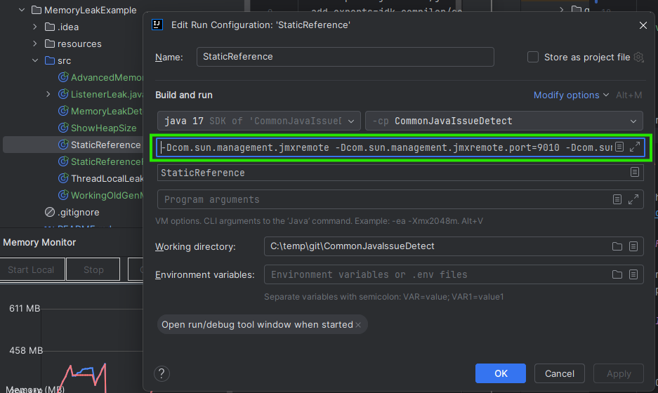
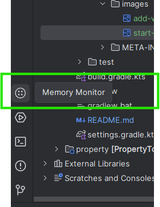
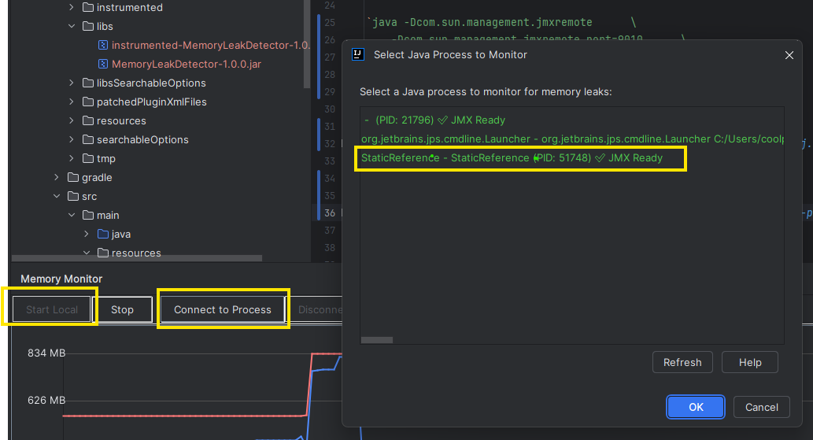
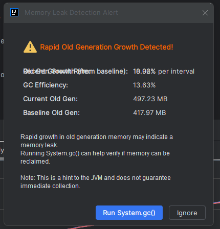
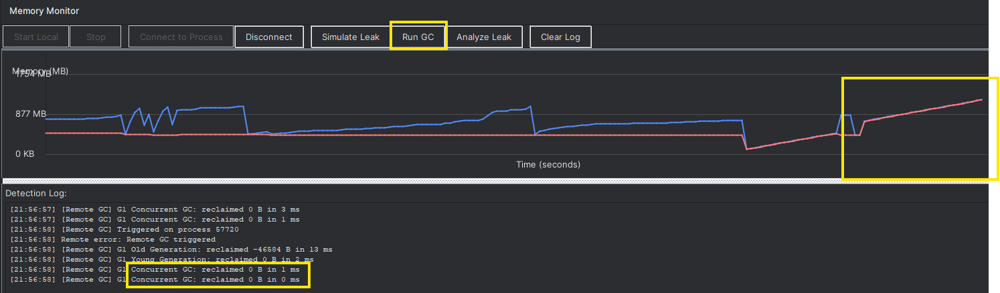

# Memory Leak Detector

An IntelliJ IDEA plugin to help detecting memory leak.

## How to Confirm a Java Memory Leak

- **Rapid Old Gen Growth**: 
    - The used heap and Old Generation (Old Gen) grow rapidly over time.

- **Ineffective Garbage Collection**:
    - After triggering GC, the Heap Used and Old Gen do not decrease significantly..

## How to Use
### 1, Install the plugin.
clone the repo

`https://github.com/pwang313-canada/intellij-plugin.git`

Navigate to the plugin directory:

`memory-leak-detector`

Build the plugin:

`./gradlew clean buildPlugin`

After MemoryLeakDetector.jar is generated, install it as a local plugin in IntelliJ IDEA.

### 2. Start Java application as follow

Add some VM parameters to command line, either from

`java -Dcom.sun.management.jmxremote      \
    -Dcom.sun.management.jmxremote.port=9020      \
    -Dcom.sun.management.jmxremote.authenticate=false      \
    -Dcom.sun.management.jmxremote.ssl=false \
    StaticReference`

Or configure them in IntelliJ:

### 3. Start the plugin and Connect to the Java application

## 4. monitor memory change

Once the plugin appears at the left bottom, you will see:

**`Start Local`**

**`Connect to Process`**

If a process appears greyed out, it means the VM parameters are not configured correctly.

you may get a warning like this

### 5. Confirm a Memory Leak

If `Used Heap` and `Old Gen` do not decrease significantly,
👉 this is a strong indication of a memory leak.

## Future Enhancements

- Located the specific file and line number for the memory leak

## Contributing

Contributions are welcome! Feel free to open issues or submit pull requests.

## License

[MIT License](LICENSE)

---

Made with ❤️ for Spring Boot developers