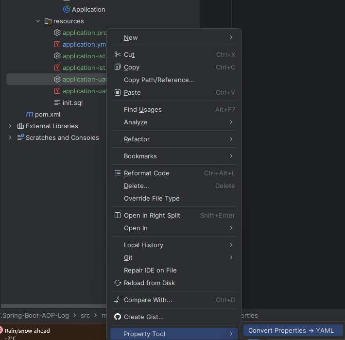
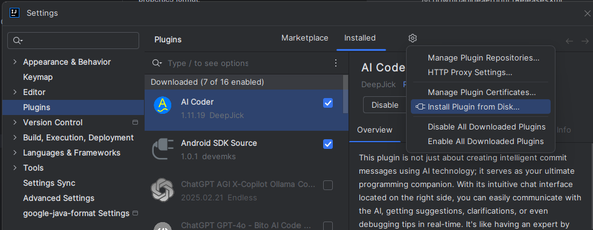

# Properties Merger & Converter

An IntelliJ IDEA plugin to help manage Spring Boot configuration files efficiently.

## Features

- **Convert between formats**: Easily convert application configuration files between `.properties` and `.yml`/`.yaml` formats.
- **Smart Properties Cleanup**:
    - Scans all `.properties` files under the `resources` folder.
    - Identifies **common properties** (keys that appear in **all** environment files with the **identical value**).
    - Moves common properties to `application.properties`.
    - Leaves environment-specific properties in their respective files (e.g. `application-dev.properties`, `application-uat.properties`, `application-prod.properties`, etc.).
    - Sorts all properties files alphabetically by key.
    - Removes duplicate entries within each file.

## How to Use

### 1. Merge & Clean Properties Files

1. Right-click on the **`resources`** folder in your project.
2. Select **"Merge and Clean Properties Files"**.
3. Confirm the action in the dialog.
4. The plugin will:
    - Move common properties to `application.properties`
    - Remove those properties from environment-specific files
    - Sort all properties files alphabetically

### 2. Convert Between Properties and YAML

Right-click on the yml or properties files, 

## Requirements

- IntelliJ IDEA (Community or Ultimate)
- Spring Boot project with configuration files under `src/main/resources`

## Installation

You can install the plugin directly from the JetBrains Marketplace:

1. Open **Settings/Preferences** → **Plugins**
2. Go to **Marketplace** tab
3. Search for "**Properties Merger & Converter**"
4. Click **Install**
   
*Alternatively, you can build from source and install the `.zip` file.*

## Screenshots

## Future Enhancements

- Bidirectional conversion between `.properties` ↔ `.yml`/`.yaml`
- Support for `bootstrap.properties` / `bootstrap.yml`
- Option to treat properties with environment names in values as env-specific
- Customizable common property detection rules

## Contributing

Contributions are welcome! Feel free to open issues or submit pull requests.

## License

[MIT License](LICENSE)

---

Made with ❤️ for Spring Boot developers