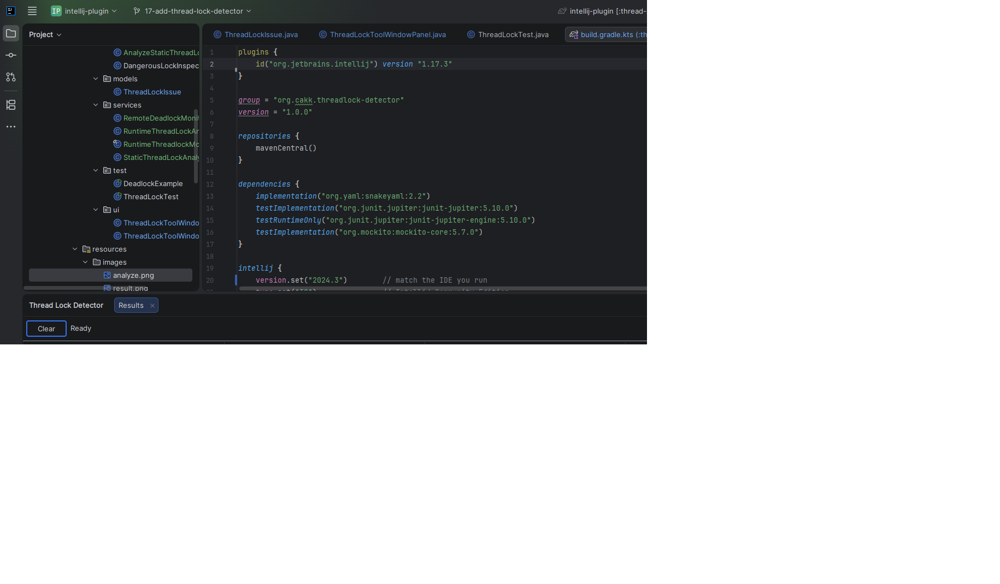
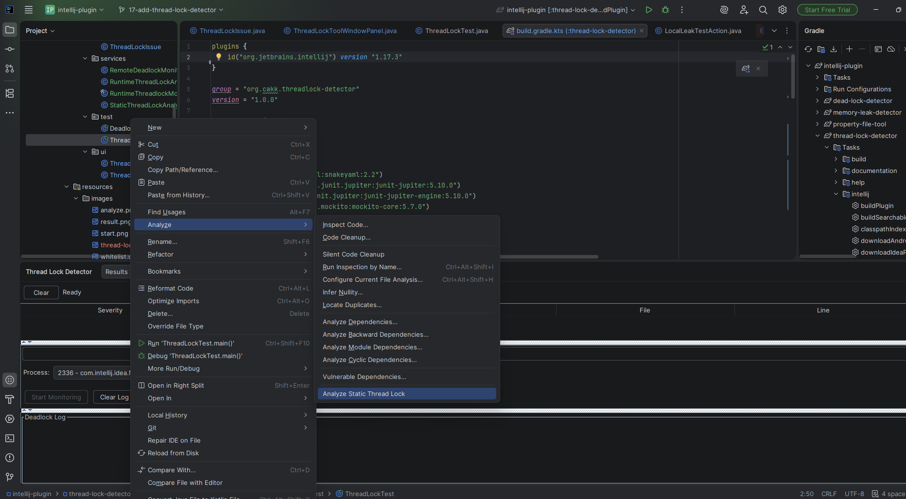
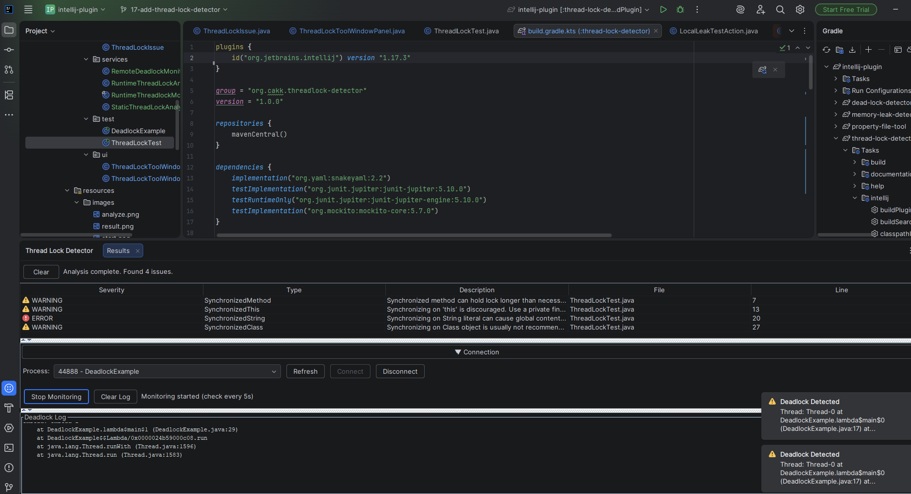

# Thread Lock Detector

Detects thread safety issues in Java code – both at compile time and during runtime execution.

## Features

### Static analysis
Scans Java files for common anti‑patterns:

- **Synchronized methods** – may hold locks longer than necessary, potentially reducing concurrency.
- **Synchronizing on `this`** – discouraged because it exposes the lock to external code.
- **Synchronizing on String literals** – can cause global contention across unrelated parts of the application.
- **Synchronizing on Class objects** – often not recommended and may lead to unintended lock scope.

Right‑click any Java file or source folder, then choose **Analyze → Analyze Static Thread Lock**. Results are shown in the **Thread Lock Detector** tool window.

### Runtime deadlock monitor
Attaches to a running Java process and detects actual deadlocks.

- Open the tool window (bottom left) and click **Refresh** to list all running Java applications.
- Select a process from the dropdown and click **Connect**.
- Once connected, click **Start Monitoring**. Any deadlock is instantly reported with full stack traces.

## User Interface

The tool window is divided into two resizable sections:

- **Top** – static analysis results in a table. Double‑click any row to navigate to the source line.
- **Bottom** – runtime monitor with collapsible connection controls, a clear log button, and a scrollable deadlock log.

Static issues are highlighted with severity icons:

- 🔴 **Error** (red)
- 🟠 **Warning** (orange)
- ℹ️ **Information** (blue)

The runtime monitor includes a **Clear Log** button to reset the deadlock display.

## Requirements

- IntelliJ IDEA 2023.3 or later (Community or Ultimate)
- Java 11+

## Installation

1. Download the plugin JAR file from the releases page (or build it yourself).
2. In IntelliJ IDEA, go to **File → Settings → Plugins**.
3. Click the gear icon and select **Install Plugin from Disk…**.
4. Choose the downloaded JAR and restart the IDE.<br/>


## Usage

### Static Analysis
- Open a Java project.
- Right‑click a Java file or a source folder in the **Project** view.
- Select **Analyze → Analyze Static Thread Lock**.
- Results appear in the **Thread Lock Detector** tool window (open via **View → Tool Windows → Thread Lock Detector** if not already visible).


### Runtime Monitoring
- Open the **Thread Lock Detector** tool window.
- Click **Refresh** to see a list of running Java processes.
- Select the process you want to monitor and click **Connect**.
- Click **Start Monitoring**. The monitor will check for deadlocks every 5 seconds.
- Any deadlock found is displayed in the log area with a full thread dump.<br/>


## Building from Source

1. Clone the repository.
2. Open the project in IntelliJ IDEA.
3. Run `./gradlew buildPlugin` to build the plugin.
4. The plugin zip will be in `build/distributions/`.
5. Example for Static and Runtime thread lock detector
```adlanguage
https://github.com/pwang313-canada/CommonJavaIssueDetect/tree/main/ThreadLockExample/src
```
## License

[Your chosen license, e.g., MIT, Apache 2.0, etc.]

## Contributing

Bug reports and pull requests are welcome. Please open an issue first to discuss any changes.

---

**Note**: The runtime monitor requires that the target Java process runs under the same user account as IntelliJ.